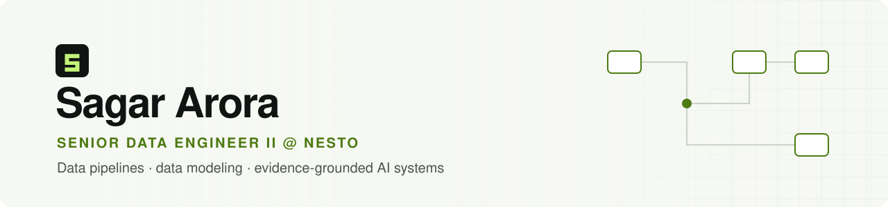
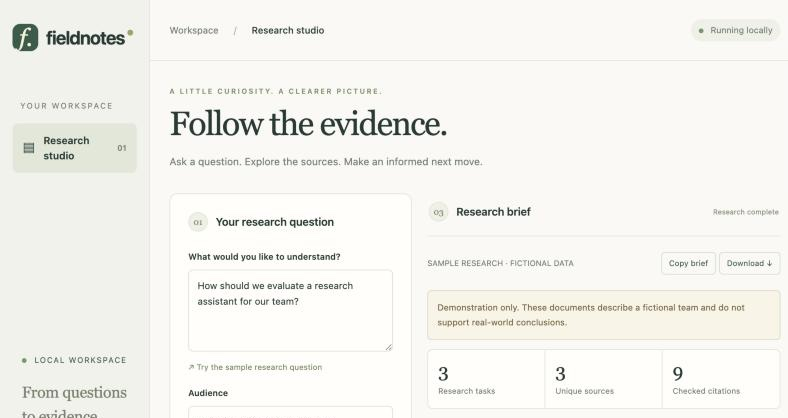

<picture>
  <source media="(prefers-color-scheme: dark)" srcset="assets/banner-dark.svg">
  
</picture>

  <a href="https://sagararora492.github.io/data-engineer-portfolio/"><b>Portfolio</b></a> ·
  <a href="https://github.com/sagararora492/data-engineer-portfolio">Projects</a> ·
  <a href="https://www.linkedin.com/in/sagararora492/">LinkedIn</a>

I'm a Senior Data Engineer II at **Nesto**, building modern data pipelines.
I care about data systems that are reliable, observable, and easy to reason about.

Outside work, I build AI systems with the same engineering discipline: bounded,
tested, and transparent about what the evidence actually supports.

### Toolkit

**Warehouse & transform** — Snowflake · BigQuery · dbt · Spark · SQL · Python 
**Orchestration & ingestion** — Airflow · Prefect · Kafka · Fivetran 
**Cloud & infrastructure** — AWS · GCP · Azure · Terraform · Docker · GitHub Actions 
**AI** — LLM APIs (OpenAI, Anthropic, Gemini) · structured outputs · agent orchestration · citation validation

---

### Featured · Fieldnotes, an agentic research assistant

A local web studio and CLI that plans research, collects sources, and writes a
brief in which every citation is checked against the stored source text.

- **Multi-model agent harness**: research agents run concurrently, each assigned
  its own model profile (OpenAI, Anthropic, Gemini, or any OpenAI-compatible endpoint).
- **Citation validation**: model output must quote exact passages from collected
  sources. Anything that fails falls back to plain extracted excerpts, with a warning.
- **Bounded and inspectable**: search budgets, retries with backoff, per-agent
  timing and token usage, and saved evidence for every run.
- **Zero runtime dependencies**: pure Python 3.12, runs fully offline on imported documents.

[Walkthrough & sample output](https://sagararora492.github.io/data-engineer-portfolio/projects/fieldnotes/) ·
[Source code](https://github.com/sagararora492/data-engineer-portfolio/tree/main/apps/ai-agentic-research-assistant)

---

### Currently

- Building more data engineering projects into the [portfolio monorepo](https://github.com/sagararora492/data-engineer-portfolio).
- Exploring evaluation and failure handling for LLM-backed data workflows.
