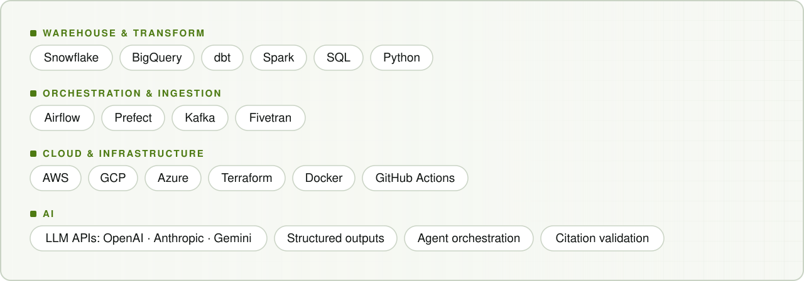
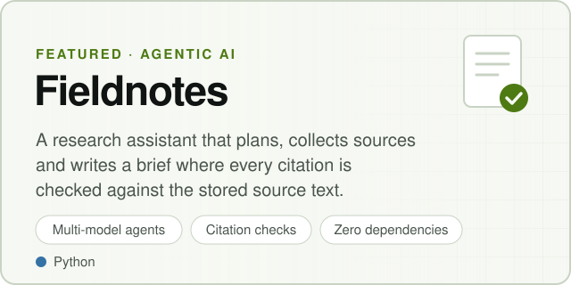
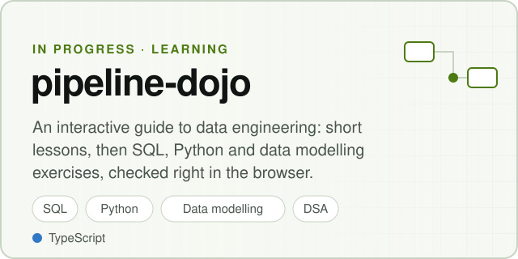

<picture>
  <source media="(prefers-color-scheme: dark)" srcset="assets/banner-dark.svg">
  
</picture>

  <a href="https://sagararora492.github.io/"><b>Portfolio</b></a> ·
  <a href="https://github.com/sagararora492?tab=repositories">Projects</a> ·
  <a href="https://www.linkedin.com/in/sagararora492/">LinkedIn</a>

I'm a Senior Data Engineer II at **Nesto** with 9+ years of experience building modern data pipelines.
I care about data systems that are reliable, observable, and easy to reason about.

Outside work, I build AI systems with the same engineering discipline: bounded,
tested, and transparent about what the evidence actually supports.

### Toolkit

<picture>
  <source media="(prefers-color-scheme: dark)" srcset="assets/toolkit-dark.svg">
  
</picture>

---

### The platform

One end-to-end ML platform, built in order: each project consumes what the previous one produces.

<picture>
  <source media="(prefers-color-scheme: dark)" srcset="assets/platform-dark.svg">
  
</picture>

| | Project | What it does | Builds on | Status |
| --- | --- | --- | --- | --- |
| 1 | [**Tributary**](https://github.com/sagararora492/tributary) | Streams Postgres changes through Debezium, Kafka and Flink into Iceberg; Trino queries, dbt models, data contracts and quality checks. | The foundation | **In progress** |
| 2 | [**Pantry**](https://github.com/sagararora492/pantry) | Feature store: offline features from Iceberg, online serving through a Go API over Redis. | Tributary's Iceberg tables | Planned |
| 3 | [**Slipway**](https://github.com/sagararora492/slipway) | Trains on Pantry's features, with model CI/CD, a registry, deployment and drift monitoring. | Pantry's features, Tributary's live stream | Planned |
| 4 | [**Switchboard**](https://github.com/sagararora492/switchboard) | API gateway: routing, rate limiting and observability. | Pantry and Slipway's serving APIs | Planned |

Runs locally on Docker Compose or kind, with Terraform for the path to the cloud. Each component gets a design doc and measured latency, throughput and cost.

### Also building

  <a href="https://sagararora492.github.io/projects/fieldnotes/"><picture>
    <source media="(prefers-color-scheme: dark)" srcset="assets/card-fieldnotes-dark.svg">
    
  </picture></a>
  <a href="https://github.com/sagararora492/pipeline-dojo"><picture>
    <source media="(prefers-color-scheme: dark)" srcset="assets/card-pipeline-dojo-dark.svg">
    
  </picture></a>

**Fieldnotes** · [Walkthrough & sample output](https://sagararora492.github.io/projects/fieldnotes/) · [Source](https://github.com/sagararora492/ai-research-agent)

---

### GitHub activity

  <picture>
    <source media="(prefers-color-scheme: dark)" srcset="profile/stats-dark.svg">
    
  </picture>
  <picture>
    <source media="(prefers-color-scheme: dark)" srcset="https://streak-stats.demolab.com/?user=sagararora492&background=101412&border=354039&stroke=354039&ring=c4f279&fire=c4f279&currStreakNum=f1f4ed&sideNums=f1f4ed&currStreakLabel=c4f279&sideLabels=b1bcb3&dates=b1bcb3">
    
  </picture>

  
<b>Contribution calendar and coding habits</b>

   
  

---

### Currently

- Building [Tributary](https://github.com/sagararora492/tributary), the data platform that the rest of the system builds on.
- Exploring evaluation and failure handling for LLM-backed data workflows.

<picture>
  <source media="(prefers-color-scheme: dark)" srcset="https://capsule-render.vercel.app/api?type=rect&color=0:0d1117%2C50:c4f279%2C100:0d1117&height=3&section=footer">
  
</picture>
